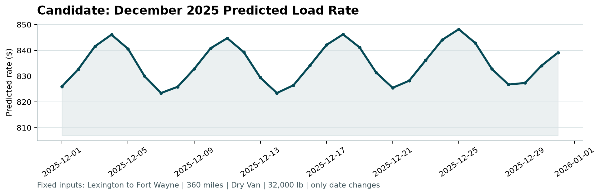

# Freight Rate ML Assessment

Technical report · Executed repository results · 06 October 2026

## 1. Executive Summary

A CatBoost solution uses **48,000 labeled loads**. The frozen 399-tree log-target model achieved mean chronological **MAE $129.41, RMSE $634.96, R² 0.8258**; Sep–Oct MAE was $116.71. Production fitting then used all labeled rows and generated 12,000 final predictions.

The original scorer accepted both outputs and created the embedded December chart. Local metrics describe historical validation; final accuracy and Spotter's hidden metrics are unavailable. A separate validated December model uses only available inputs.

## 2. Dataset Overview

| File | Rows × columns | Dates / role |
| --- | --- | --- |
| train_test.csv | 48,000 × 14 | Jan 1–Oct 31, 2025; labeled development |
| validation.csv | 12,000 × 13 | Nov 1–Dec 31, 2025; final inference |
| validation_predictions_template.csv | 12,000 × 2 | Unique load IDs; original rate cells remain blank |
| december_chart_inputs.csv | 31 × 7 | Every day of December 2025; fixed scenario |

The target is `posted_rate` in dollars; predictor schemas otherwise match. `load_id` is excluded from features. Raw datasets and the supplied scorer are protected by recorded SHA-256 hashes.

## 3. Data Quality Issues

| Issue | Development rows | Final-inference rows |
| --- | --- | --- |
| Missing weight | 300 | 165 |
| Negative weight | 292 | 145 |
| Missing market_index | 374 | 249 |
| Missing quote_signal | 0 | 0 |

No row was deleted. Negative weights may reflect sign corruption; their cause is unverified. Features use `abs(weight)` plus original missing/negative flags. CatBoost handles numeric NaNs natively; missing categories become explicit strings. Malformed nonmissing values and infinities fail explicitly. No duplicate load IDs or exact duplicate loads were found.

Final inference has **8 new cities**, affecting **1,447 rows (12.06%)**, and **736 new routes**, affecting **1,461 rows (12.17%)**. Coordinates are retained; CatBoost accepts new labels and sklearn uses `handle_unknown="ignore"`. Compatibility does not establish future-city accuracy.

## 4. Exploratory Findings

Distance strongly tracks total rate (Pearson correlation 0.909). Rates are right-tailed: minimum $57.22, median $2,030.76, mean $2,373.98, maximum $25,533.00. Large observations were retained rather than automatically clipped or removed.

Median dollars per mile: Dry Van $2.05, Flatbed $2.22, Reefer $2.31. Calendar/load mix also varies. These associations are not causal premiums; market/quote usefulness requires chronological experiments.

<!-- page-break -->

## 5. Validation Strategy

Three expanding chronological folds reproduce the task's ordering: learn from earlier loads, then predict the next two months. All dates below are in **2025**. Every row of a calendar date remains together; training never crosses into its later validation period. Final Nov–Dec inputs are excluded from model selection, tuning, and accuracy metrics.

| Fold | Training period | Validation period | Train / validation rows |
| --- | --- | --- | --- |
| 1 | Jan 1–Apr 30 | May 01–Jun 30 | 19,110 / 9,696 |
| 2 | Jan 1–Jun 30 | Jul 01–Aug 31 | 28,806 / 9,671 |
| 3 | Jan 1–Aug 31 | Sep 01–Oct 31 | 38,477 / 9,523 |

Fold 3 is the primary recent holdout: training **2025-01-01–2025-08-31**, validation **2025-09-01–2025-10-31**. A random split would mix future observations and calendar/market regimes into training. MAE is primary; RMSE and R² report large-error behavior and fit on the original dollar scale.

Actual primary-model fixed-budget results:

| Validation | MAE ($) | RMSE ($) | R² |
| --- | --- | --- | --- |
| May–Jun | 142.56 | 644.49 | 0.8265 |
| Jul–Aug | 128.96 | 623.89 | 0.8248 |
| Sep–Oct | 116.71 | 636.50 | 0.8260 |
| Unweighted fold mean | 129.41 | 634.96 | 0.8258 |

All learned sklearn imputation, scaling, and categorical vocabularies are fitted on each applicable training fold. CatBoost's learned categorical statistics are training-fold local; missing numeric handling is native. Feature generation is stateless and row-wise.

Initial experiments used the outer chronological holdout for early stopping. Shortlisted candidates were confirmed with fixed median tree budgets, without an eval_set. Historical folds were reused for selection, so these are selection estimates, not an untouched test. Fold averages are unweighted and are not pooled metrics.

## 6. Feature Engineering

One shared builder in `src/features.py` serves both training and inference. The primary ordered whitelist has **26 features**; it excludes `load_id`, `posted_rate`, and `predicted_rate`. No external target encoding is used. The calendar reference remains 2025-01-01.

| Group | Selected feature names |
| --- | --- |
| Operational | distance, equipment, weight_clean, weight_missing, weight_negative |
| Geographic | pickup, delivery, pickup_lat, pickup_lon, delivery_lat, delivery_lon |
| Route | route = pickup + " -> " + delivery |
| Calendar | month, day, day_of_week, day_of_year, iso_week, weekend, days_since_reference_date |
| Cyclical | sin_day_of_week, cos_day_of_week, sin_day_of_year, cos_day_of_year |
| Market | market_index, market_index_missing, quote_signal |

`weight_clean` is absolute original weight; missing cleaned weights remain NaN. Missing/negative flags describe the original measurement. City/route strings support native categories, while coordinates supply information when labels are unseen. The December model retains operational, geographic, calendar, and cyclic features: **22 features**, excluding route and market/quote fields.

Evidence: `docs/validation_plan.md`, `docs/final_model_config.json`, `reports/model_comparison.csv`, and `src/features.py`.

<!-- page-break -->

## 7. Model Experiments

Executed comparisons include global median, distance-only linear regression, Ridge, and three modest CatBoost settings (depths 6/7/8). Controlled experiments add operational/calendar → cities → coordinates → route → market_index → quote_signal on the same folds, and compare raw weight with absolute weight plus flags, and direct with log1p targets. No large search was performed.

Mean chronological metrics for the baselines and fixed-budget finalists:

| Model | MAE ($) | RMSE ($) | R² |
| --- | --- | --- | --- |
| Global median | 1,151.00 | 1,572.59 | -0.0685 |
| Distance linear | 201.23 | 658.83 | 0.8124 |
| Ridge | 252.81 | 687.48 | 0.7954 |
| F-clean/direct, 284 trees | 131.00 | 634.46 | 0.8260 |
| Selected F-clean/log, 399 trees | 129.41 | 634.96 | 0.8258 |
| December C-clean/direct, 541 trees | 143.85 | 637.14 | 0.8245 |

Market features improve aggregate MAE, but their incremental benefit varies by fold. Quote gains are modest and mixed. The full selected bundle won among executed configurations; route's contribution conditional on that final bundle was not isolated. Source provenance and prediction-time availability of market/quote signals remain limitations, not demonstrated leakage.

## 8. Final Model Selection

The primary is **CatBoostRegressor, 399 trees, depth 6, learning_rate 0.05, l2_leaf_reg 5, MAE loss, random_seed 42, thread_count 4, nan_mode Min**. It fits `log1p(posted_rate)` and converts predictions with `expm1`. The feature list and tree budget were frozen before full-data production fitting.

Selection prioritized fixed-budget mean chronological MAE, recent holdout behavior, stability, missing/unseen robustness, and realistic inputs. The selected model beats every simple baseline. Log modeling improves mean MAE from $131.00 to $129.41 versus the fixed direct-target alternative, but slightly worsens recent MAE and mean RMSE; it does not win every metric. Its Sep–Oct results are **MAE $116.71, RMSE $636.50, R² 0.8260**.

## 9. Final Prediction Process

Both frozen models train on all 48,000 development rows with no eval_set or early stopping. Native models, preprocessing specifications, deterministic city coordinates, feature/source hashes, parameters, versions, and historical metrics are saved under `artifacts/`.

The saved primary predicts every final-inference load. Predictions join to template IDs **one-to-one by load_id**, in template order, with exactly `load_id,predicted_rate` and no index. Checks reject missing/duplicate/extra IDs and nonfinite or nonpositive rates. The frozen $0.01 guard altered zero production rates.

| Output | Rows | Minimum ($) | Maximum ($) | Mean ($) | Median ($) |
| --- | --- | --- | --- | --- | --- |
| Final inference | 12,000 | 205.35 | 6,690.05 | 2,353.47 | 2,036.72 |
| December | 31 | 823.46 | 848.20 | 834.94 | 834.04 |

Saved-model inference after the production run reproduced both CSV hashes exactly. Output summaries are not accuracy metrics.

<!-- page-break -->

## 10. December Scenario

The official chart fixes **Lexington → Fort Wayne, 360 miles, Dry Van, 32,000 lb**, while the date changes from **2025-12-01 through 2025-12-31**. All original six inputs and the seven-column CSV order are preserved; only `predicted_rate` is filled.



The separate frozen **541-tree group-C direct-target model** uses the same chronological philosophy and only available fields. Coordinates come from consistent city lookups in supplied development data; no future market_index or quote_signal is invented. Its mean historical MAE/RMSE/R² are **$143.85 / $637.14 / 0.8245**. These do not establish accuracy for the fixed December lane. Actual December rates range from **$823.46 to $848.20**.

The original `score.py` validated 12,000 final predictions and 31 fixed December predictions and created this chart. It validates contracts; hidden accuracy is calculated by Spotter after submission.

## 11. Limitations and Improvements

- Reused historical folds can overstate generalization; an independent later labeled period or nested chronological stopping split would strengthen evaluation.
- November/December labels and unseen-city accuracy are unavailable. Ten months do not establish full-year seasonality; trees have limited extrapolation beyond observed calendar ranges.
- Large-rate errors remain: RMSE is substantially above MAE. Investigate tail provenance and performance by lane/equipment before changing target treatment.
- Verify market/quote timestamps and availability, supplied coordinate accuracy, and weight-error origins. Their current uncertainty is documented rather than assumed away.
- Future work could monitor temporal/input drift and calibration. These are proposed improvements, not completed experiments.

## 12. Reproducibility

Verified with Windows Python 3.12.5 and the pinned versions in `constraints.txt`. From the repository root in PowerShell (macOS/Linux commands are in README):

```powershell
py -3.12 -m venv .venv
$env:PYTHONUTF8 = "1"
$env:MPLCONFIGDIR = ".cache/matplotlib"
$python = ".\.venv\Scripts\python.exe"
& $python -m pip install -r requirements.txt -c constraints.txt
& $python run_pipeline.py
& $python -m pytest -q
& $python score.py --predictions validation_predictions.csv `
  --december-predictions data/december_chart_inputs.csv
& $python scripts/build_report.py
```

The pipeline validates, trains, saves, predicts, and checks integrity without rerunning research. Recorded verification: **110 tests plus 4 subtests passed**, pipeline passed, original scorer passed. Protected inputs remain unchanged. `README.md`, `docs/worklog.md`, and metadata provide the audit trail. Publication and an actual Loom recording are separate submission steps.
