# Exploratory data analysis

Generated reproducibly by `scripts/eda.py`. No model is fitted, no rows are removed, no targets are clipped, and no raw files are modified. Plots use all eligible observations; missing values are omitted only where a variable cannot be plotted and counts are explicitly reported. No random sampling or jitter is used (reserved random seed: 42).

Reproduce from the project root:

```bash
.venv/bin/python scripts/eda.py
```

| Dataset | Rows | Date range | Role |
| --- | --- | --- | --- |
| Development | 48,000 | 2025-01-01 through 2025-10-31 | Labeled EDA only |
| Final inputs | 12,000 | 2025-11-01 through 2025-12-31 | Quality and descriptive shifts only |

Target: **posted_rate**. `load_id` is an identifier. Final inputs contain no labels and are never used here for model selection, training, preprocessing fitting, or validation metrics. A complete input audit is in `../docs/data_audit.md`.

## 1–2. posted_rate distribution and summary statistics

| Statistic | Posted rate ($) | Rate per mile ($/mile) |
| --- | --- | --- |
| count | 48,000 | 48,000 |
| mean | 2,373.980682 | 2.215347 |
| std | 1,486.493245 | 0.583887 |
| min | 57.22 | 0.333709 |
| 1% | 327.1688 | 1.673521 |
| 5% | 599.7385 | 1.807533 |
| 25% | 1,251.555 | 1.986974 |
| 50% | 2,030.76 | 2.145348 |
| 75% | 3,330.75 | 2.342696 |
| 95% | 4,953.7665 | 2.735925 |
| 99% | 5,972.834 | 3.17694 |
| max | 25,533 | 14.125294 |

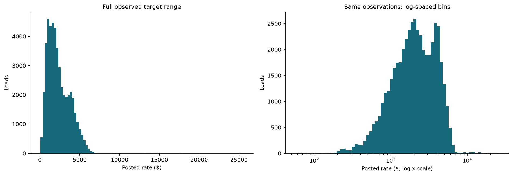

Both panels retain all labeled targets, including the complete high-rate tail.

## 3. posted_rate over calendar time

| Month | Rows | Mean rate | Median rate | Median $/mile | Median distance | Mean market index |
| --- | --- | --- | --- | --- | --- | --- |
| 2025-01 | 4,918 | 2,255.967048 | 1,915.2 | 2.029158 | 950.85 | 0.926696 |
| 2025-02 | 4,337 | 2,273.804801 | 1,994.25 | 2.061143 | 966.3 | 0.995997 |
| 2025-03 | 5,036 | 2,372.268092 | 2,022.92 | 2.139279 | 954.6 | 1.07288 |
| 2025-04 | 4,819 | 2,372.162308 | 2,044.24 | 2.146699 | 956.6 | 1.207649 |
| 2025-05 | 4,913 | 2,421.776342 | 2,065.51 | 2.190194 | 953 | 1.301452 |
| 2025-06 | 4,783 | 2,497.030115 | 2,120.22 | 2.247885 | 950.7 | 1.280316 |
| 2025-07 | 4,912 | 2,415.16203 | 2,059.145 | 2.187422 | 955.7 | 1.200893 |
| 2025-08 | 4,759 | 2,338.407661 | 2,015.73 | 2.120525 | 957.1 | 0.98148 |
| 2025-09 | 4,670 | 2,406.374013 | 2,057.13 | 2.159622 | 954.4 | 0.893039 |
| 2025-10 | 4,853 | 2,379.051374 | 2,035.9 | 2.163828 | 937.3 | 0.957502 |

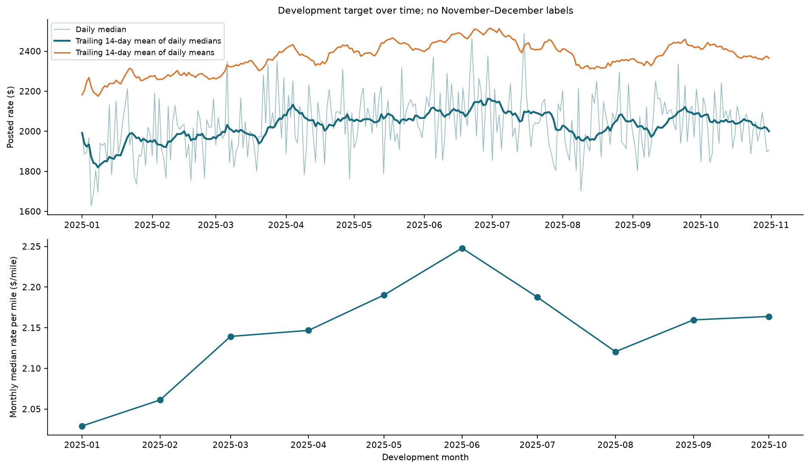

Monthly and trailing summaries are descriptive only; trailing windows are never used here as model features.

Changes can reflect freight mix, equipment, route, market, and date effects. Ten observed months cannot establish recurring annual seasonality or November–December target behavior.

## 4. Rate versus distance

| Association | Complete pairs | Pearson | Spearman |
| --- | --- | --- | --- |
| Distance / posted_rate | 48,000 | 0.908519 | 0.975969 |
| Distance / rate_per_mile | 48,000 | -0.334601 | -0.735659 |

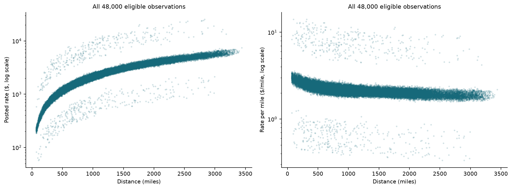

Logarithmic vertical axes show all positive observations, including outliers; no axes were trimmed to remove them.

Distance is strongly associated with total rate. Rate per mile also changes with distance, so dividing by miles does not fully control freight mix or establish a constant per-mile price.

## 5. Rate-per-mile distribution

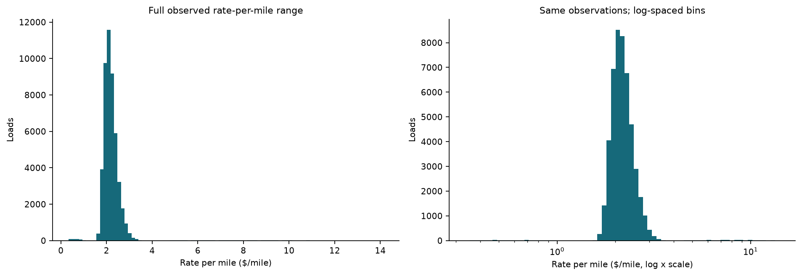

Rate per mile is posted_rate / distance, calculated for EDA only. It depends on the target and must never become an inference feature.

## 6. Rate versus weight

| Weight representation / posted_rate | Complete pairs | Pearson | Spearman |
| --- | --- | --- | --- |
| weight | 47,700 | 0.03484 | 0.041676 |
| weight_clean | 47,700 | 0.041343 | 0.042055 |

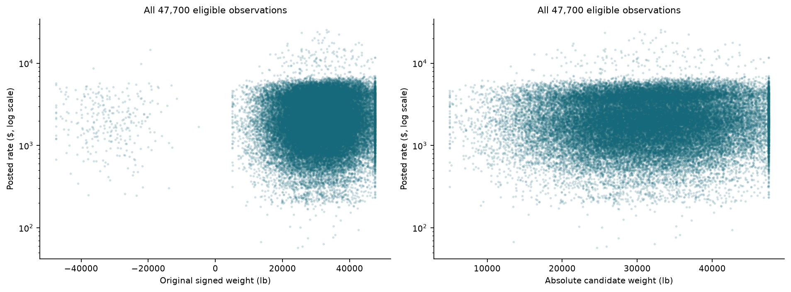

Only 300 missing weights are unavailable for these plots; their rows and targets remain in the dataset.

Absolute weight and original missing/negative flags are candidates, not selected features. The weak marginal association with total price does not imply that weight is irrelevant in interactions or within freight subgroups.

## 7. Equipment differences

| Equipment | Rows | Mean rate | Median rate | Median $/mile | Median distance |
| --- | --- | --- | --- | --- | --- |
| Dry Van | 27,202 | 2,271.548686 | 1,953.035 | 2.046203 | 957.55 |
| Reefer | 12,045 | 2,553.636939 | 2,196.67 | 2.31154 | 950.2 |
| Flatbed | 8,753 | 2,445.087223 | 2,076.81 | 2.219683 | 940 |

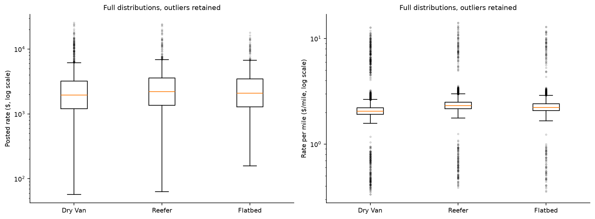

Outliers are shown for every equipment group. Equipment comparisons remain observational, with route and distance mix as potential confounders.

## 8. Pickup markets

Development has **64** pickup categories. Full summaries for every market are saved in `eda_pickup_markets.csv`.

| Pickup | Rows | Mean rate | Median rate | Median $/mile | Median distance |
| --- | --- | --- | --- | --- | --- |
| Oklahoma City | 1,242 | 2,219.075097 | 2,138.895 | 2.195999 | 994.45 |
| Lexington | 1,209 | 1,824.140273 | 1,374.59 | 2.24395 | 616 |
| Bakersfield | 1,193 | 3,519.365448 | 3,804.88 | 2.004777 | 1,961.4 |
| Fort Wayne | 1,170 | 1,996.960462 | 1,711.435 | 2.157486 | 806.7 |
| Hartford | 1,150 | 2,671.385409 | 2,228.705 | 2.05845 | 1,075.2 |
| Richmond | 1,140 | 2,288.463088 | 1,746.695 | 2.127537 | 816.1 |
| Nashville | 1,124 | 1,761.969226 | 1,435.715 | 2.273804 | 668.45 |
| Phoenix | 1,121 | 3,764.774764 | 3,935.62 | 1.99963 | 2,024.2 |
| Baton Rouge | 1,115 | 2,105.062404 | 1,902.94 | 2.227921 | 836.6 |
| Mobile | 1,094 | 1,949.795128 | 1,669.675 | 2.253882 | 728.95 |
| Cincinnati | 1,080 | 1,775.167185 | 1,436.255 | 2.255484 | 647.55 |
| Shreveport | 1,062 | 1,935.904087 | 1,744.22 | 2.238193 | 806.1 |

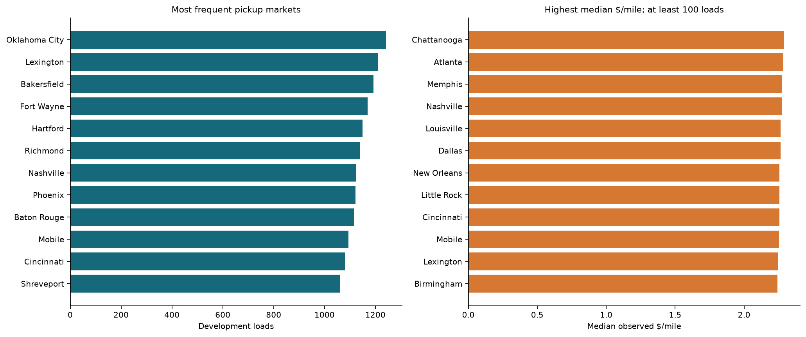

These are unadjusted summaries of observed lane and equipment mixes. The 100-load cutoff is a fixed display rule, not a training-data filter or model-selection rule.

## 9. Delivery markets

Development has **64** delivery categories. Full summaries for every market are saved in `eda_delivery_markets.csv`.

| Delivery | Rows | Mean rate | Median rate | Median $/mile | Median distance |
| --- | --- | --- | --- | --- | --- |
| Lexington | 1,197 | 1,825.932698 | 1,391.98 | 2.246717 | 611.1 |
| Fort Wayne | 1,176 | 1,981.883495 | 1,700.17 | 2.158467 | 800 |
| Baton Rouge | 1,167 | 2,109.52006 | 1,939.01 | 2.214281 | 881 |
| Bakersfield | 1,156 | 3,532.198893 | 3,742.535 | 2.012341 | 1,930.25 |
| Hartford | 1,143 | 2,686.995372 | 2,248.05 | 2.068603 | 1,078.6 |
| Oklahoma City | 1,140 | 2,332.683702 | 2,224.92 | 2.192997 | 1,028.75 |
| Richmond | 1,109 | 2,231.707448 | 1,691.98 | 2.133572 | 783.1 |
| Atlanta | 1,096 | 1,796.178449 | 1,475.73 | 2.265162 | 671.5 |
| Phoenix | 1,090 | 3,751.47311 | 3,921.98 | 2.004841 | 2,014.05 |
| Mobile | 1,089 | 1,957.16135 | 1,769.32 | 2.238715 | 799 |
| Cincinnati | 1,084 | 1,743.254972 | 1,401.65 | 2.257061 | 633.15 |
| Columbia | 1,071 | 1,905.366909 | 1,523.87 | 2.224263 | 718.1 |

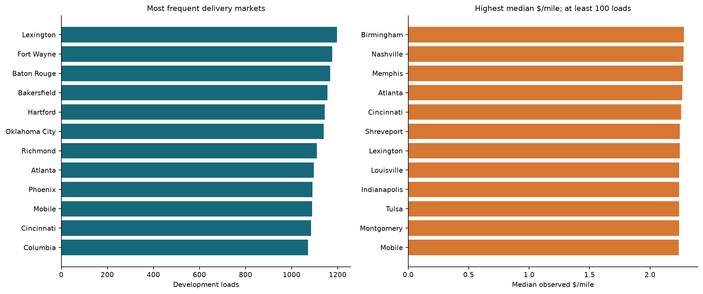

These are unadjusted summaries of observed lane and equipment mixes. The 100-load cutoff is a fixed display rule, not a training-data filter or model-selection rule.

## 10. Route frequency

| Statistic | Development | Final inputs |
| --- | --- | --- |
| Distinct observed routes | 4,014 | 4,214 |
| Routes observed once | 67 | 1,232 |
| Median observed loads per route | 10 | 2 |
| Maximum observed loads per route | 39 | 14 |

| Top development route | Loads |
| --- | --- |
| Phoenix -> Shreveport | 39 |
| Lexington -> Atlanta | 39 |
| Columbia -> Oklahoma City | 39 |
| Fort Wayne -> Philadelphia | 38 |
| Lexington -> Kansas City | 37 |
| Richmond -> Phoenix | 37 |
| Fort Wayne -> Hartford | 37 |
| Lexington -> Cincinnati | 37 |
| Shreveport -> Hartford | 37 |
| Richmond -> Oklahoma City | 37 |
| Mobile -> Phoenix | 36 |
| Fort Wayne -> Cincinnati | 36 |

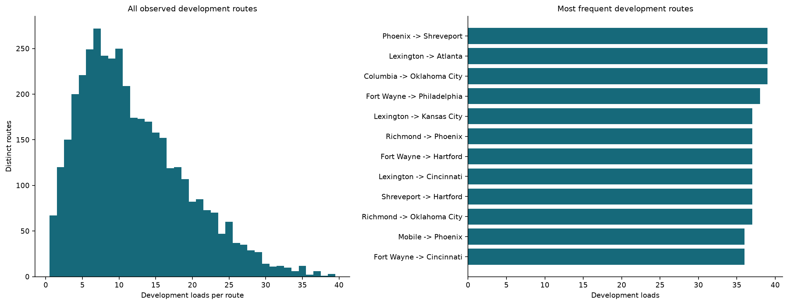

Route categories are relatively sparse even with 48,000 labeled observations.

Final inputs contain **736** unseen routes across **1,461 rows**. Different sample sizes affect frequency summaries; unseen routes must not cause inference failures and route identity should not be the sole geographic signal.

## 11. market_index

| Development outcome | Complete pairs | Pearson | Spearman |
| --- | --- | --- | --- |
| posted_rate | 47,626 | 0.034165 | 0.031505 |
| rate_per_mile | 47,626 | 0.083478 | 0.179755 |

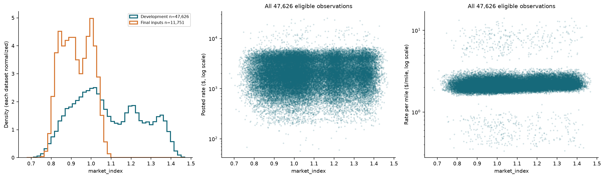

Outcome relationships use development labels only. The overlaid feature densities describe final inputs without fitting or selecting a model.

| Dataset | Month | Nonmissing | Mean index | Median index |
| --- | --- | --- | --- | --- |
| Development | 2025-01 | 4,882 | 0.926696 | 0.932905 |
| Development | 2025-02 | 4,301 | 0.995997 | 0.99313 |
| Development | 2025-03 | 4,992 | 1.07288 | 1.06485 |
| Development | 2025-04 | 4,788 | 1.207649 | 1.207125 |
| Development | 2025-05 | 4,870 | 1.301452 | 1.304025 |
| Development | 2025-06 | 4,741 | 1.280316 | 1.27513 |
| Development | 2025-07 | 4,876 | 1.200893 | 1.2121 |
| Development | 2025-08 | 4,726 | 0.98148 | 0.98234 |
| Development | 2025-09 | 4,639 | 0.893039 | 0.88781 |
| Development | 2025-10 | 4,811 | 0.957502 | 0.95818 |
| Final inputs | 2025-11 | 5,721 | 0.918716 | 0.91229 |
| Final inputs | 2025-12 | 6,030 | 0.93469 | 0.931515 |

Market-index differences mix calendar periods and load composition. Monthly means contextualize the pooled shift; ten labeled months do not prove a repeatable full-year seasonal pattern.

## 12. quote_signal

| Development outcome | Complete pairs | Pearson | Spearman |
| --- | --- | --- | --- |
| posted_rate | 48,000 | -0.039858 | -0.039912 |
| rate_per_mile | 48,000 | 0.049342 | 0.091064 |

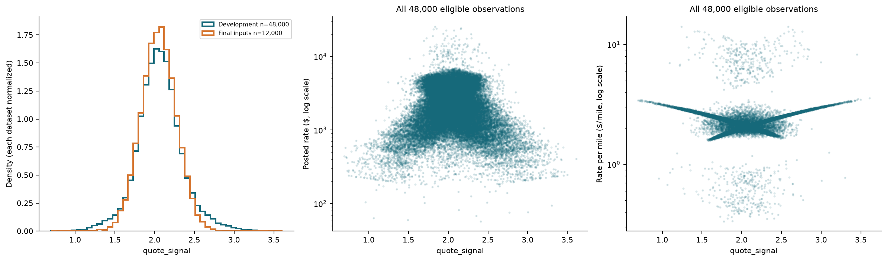

Outcome relationships use development labels only. The overlaid feature densities describe final inputs without fitting or selecting a model.

Quote-signal marginal correlations are weak in this dataset. They do not establish whether interactions are useful. Its provenance, units, and availability before a rate is posted are undocumented; presence in supplied inference data does not resolve that uncertainty. Any future use needs development-only chronological ablation and a realistic December strategy.

## 13. Numeric correlations

| Variable | Target pair count | Pearson / target | Spearman / target | Spearman / $ per mile |
| --- | --- | --- | --- | --- |
| distance | 48,000 | 0.908519 | 0.975969 | -0.735659 |
| weight | 47,700 | 0.03484 | 0.041676 | 0.196073 |
| weight_clean | 47,700 | 0.041343 | 0.042055 | 0.19905 |
| weight_missing | 48,000 | -0.001244 | -0.000795 | -0.005428 |
| weight_negative | 48,000 | 0.000832 | -0.001505 | 0.005622 |
| market_index | 47,626 | 0.034165 | 0.031505 | 0.179755 |
| quote_signal | 48,000 | -0.039858 | -0.039912 | 0.091064 |
| pickup_lat | 48,000 | -0.090873 | -0.11208 | -0.044535 |
| pickup_lon | 48,000 | -0.255058 | -0.196526 | 0.050093 |
| delivery_lat | 48,000 | -0.09197 | -0.114916 | -0.041807 |
| delivery_lon | 48,000 | -0.257086 | -0.199305 | 0.049896 |

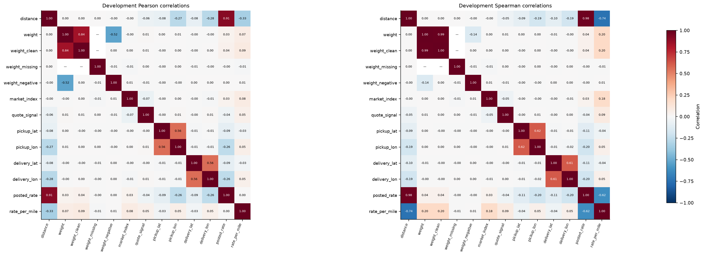

Full Pearson and Spearman matrices and complete-pair counts are exported as CSVs. Correlations use pairwise available development observations.

A dash denotes undefined correlation when the available pairs leave a variable constant; for example, the missing-weight flag is always zero among observed weights. This is not a zero-correlation claim.

Identifiers are excluded from this analysis. `posted_rate` and its derived `rate_per_mile` appear only as analysis outcomes, never model features. Correlation is not causation or evidence of out-of-sample predictive improvement.

## 14. Missing values

| Shared predictor | Train missing | Train % | Final missing | Final % |
| --- | --- | --- | --- | --- |
| pickup | 0 | 0 | 0 | 0 |
| delivery | 0 | 0 | 0 | 0 |
| pickup_lat | 0 | 0 | 0 | 0 |
| pickup_lon | 0 | 0 | 0 | 0 |
| delivery_lat | 0 | 0 | 0 | 0 |
| delivery_lon | 0 | 0 | 0 | 0 |
| distance | 0 | 0 | 0 | 0 |
| equipment | 0 | 0 | 0 | 0 |
| weight | 300 | 0.625 | 165 | 1.375 |
| date | 0 | 0 | 0 | 0 |
| market_index | 374 | 0.779167 | 249 | 2.075 |
| quote_signal | 0 | 0 | 0 | 0 |

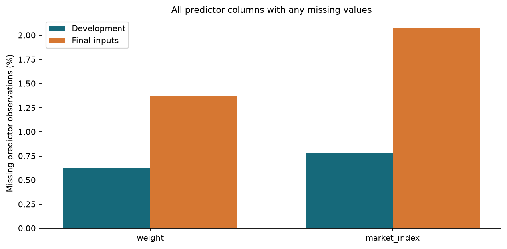

Both datasets retain all rows. Missing output placeholders in the template and December file are intentional and are not counted as missing predictors.

No imputation is fitted during EDA. Missing cleaned weight stays NaN. Later learned preprocessing must be fitted only within each development training fold.

## 15. Negative weights

| Dataset | Rows | Missing weight | Negative weight | Negative % | Abs min lb | Abs max lb |
| --- | --- | --- | --- | --- | --- | --- |
| Development | 48,000 | 300 | 292 | 0.608333 | 5,000 | 47,500 |
| Final inputs | 12,000 | 165 | 145 | 1.208333 | 5,000 | 47,500 |

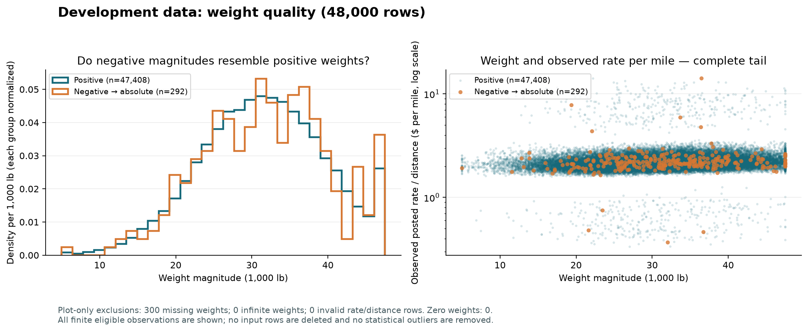

Negative magnitudes resemble positive weights, supporting sign corruption as a hypothesis. The full development rate-per-mile tail is shown.

Negative rows are preserved. Absolute weight plus original-value indicators remains a candidate representation until compared with raw weight in identical chronological folds. See `../docs/data_audit.md` for the detailed weight investigation.

## 16. Geographic variables

| Coordinate | Train min | Train max | Final min | Final max | Train missing | Final missing |
| --- | --- | --- | --- | --- | --- | --- |
| pickup_lat | 28.35765 | 44.30296 | 25.5 | 44.30296 | 0 | 0 |
| pickup_lon | -121.69849 | -69.5 | -121.69849 | -69.5 | 0 | 0 |
| delivery_lat | 28.35765 | 44.30296 | 25.5 | 44.30296 | 0 | 0 |
| delivery_lon | -121.69849 | -69.5 | -121.69849 | -69.5 | 0 | 0 |

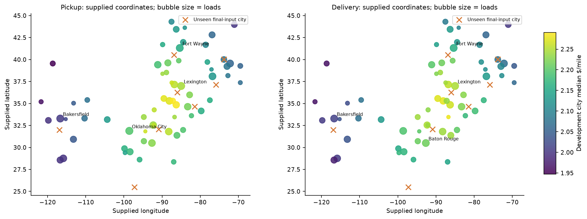

Coordinates are the supplied lookup values, not externally verified geocodes. City colors are unadjusted development summaries, not learned target encodings.

There are **1,447 final-input rows (12.06%)** with an unseen city. Coordinates offer numeric location context when city or route labels are new; location names alone need unknown-category handling. Coordinate/rate associations may largely reflect route length and lane composition.

## 17. Potential target outliers

| Rule | Threshold | Flagged rows |
| --- | --- | --- |
| Below lower 1.5×IQR fence | -1,867.2375 | 0 |
| Above upper 1.5×IQR fence | 6,449.5425 | 260 |
| Above 99th percentile | 5,972.834 | 480 |
| Rate above $10,000 | 10,000 | 103 |

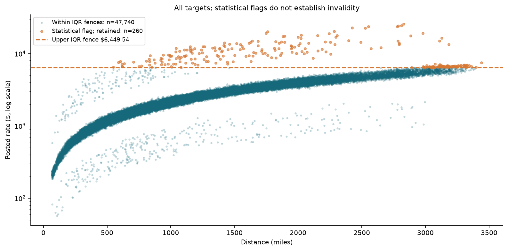

No target is clipped, winsorized, corrected, or removed. Largest-rate examples remain in the dataset.

| load_id (locator only) | Date | Pickup | Delivery | Miles | Equipment | Raw weight | Posted rate | $ per mile |
| --- | --- | --- | --- | --- | --- | --- | --- | --- |
| TR-012185 | 2025-03-19 | Bakersfield | Hartford | 2,829.8 | Dry Van | 33,153 | 25,533 | 9.022899 |
| TR-037765 | 2025-08-27 | Phoenix | Syracuse | 2,810.9 | Dry Van | 33,674 | 24,294.98 | 8.643132 |
| TR-001467 | 2025-01-10 | Los Angeles | Syracuse | 2,786 | Reefer | 30,322 | 24,140.21 | 8.664828 |
| TR-017372 | 2025-04-20 | Reno | Philadelphia | 2,777.6 | Reefer | 33,158 | 23,662.71 | 8.519121 |
| TR-026236 | 2025-06-15 | Charleston | Phoenix | 2,552.5 | Dry Van | 25,665 | 23,580.42 | 9.238167 |
| TR-028220 | 2025-06-27 | Tucson | Raleigh | 2,423.3 | Dry Van | 30,972 | 22,755.66 | 9.39036 |
| TR-003354 | 2025-01-22 | Phoenix | Charleston | 2,527.9 | Reefer | 36,840 | 22,534.65 | 8.914376 |
| TR-040172 | 2025-09-11 | Montgomery | Fresno | 2,283.4 | Dry Van | 32,447 | 20,361.89 | 8.917356 |
| TR-040097 | 2025-09-11 | Baltimore | Oklahoma City | 1,760.3 | Reefer | 29,521 | 20,132.37 | 11.436897 |
| TR-047299 | 2025-10-27 | Boston | Bakersfield | 2,979.1 | Reefer | 30,585 | 19,110.3 | 6.41479 |

Identifiers above locate observations for review and are never predictive features. A large price is not sufficient evidence of invalidity; pricing provenance is unavailable. Evaluate direct versus log-target models later on identical chronological folds, and record both MAE and RMSE to understand sensitivity to tails.

## 18. Development versus final-input distribution shifts

| Feature | Train finite | Final finite | Train mean | Final mean | Train SD | Final SD | Empirical KS D |
| --- | --- | --- | --- | --- | --- | --- | --- |
| distance | 48,000 | 12,000 | 1,135.856654 | 1,141.7731 | 728.564416 | 732.333797 | 0.007187 |
| weight_clean | 47,700 | 11,835 | 31,417.249245 | 31,282.954626 | 7,996.515399 | 7,987.942191 | 0.009563 |
| market_index | 47,626 | 11,751 | 1.083387 | 0.926913 | 0.168091 | 0.074109 | 0.483213 |
| quote_signal | 48,000 | 12,000 | 2.062468 | 2.051334 | 0.291391 | 0.219804 | 0.045937 |
| pickup_lat | 48,000 | 12,000 | 35.647545 | 35.574216 | 4.315285 | 4.366999 | 0.012479 |
| delivery_lat | 48,000 | 12,000 | 35.641175 | 35.609538 | 4.317199 | 4.351844 | 0.010271 |

| Category | Train distinct | Final distinct | Unseen distinct | Unseen final rows | Total variation distance |
| --- | --- | --- | --- | --- | --- |
| pickup | 64 | 72 | 8 | 725 | 0.068083 |
| delivery | 64 | 72 | 8 | 722 | 0.067479 |
| equipment | 3 | 3 | 0 | 0 | 0.003313 |
| route | 4,014 | 4,214 | 736 | 1,461 | 0.303708 |

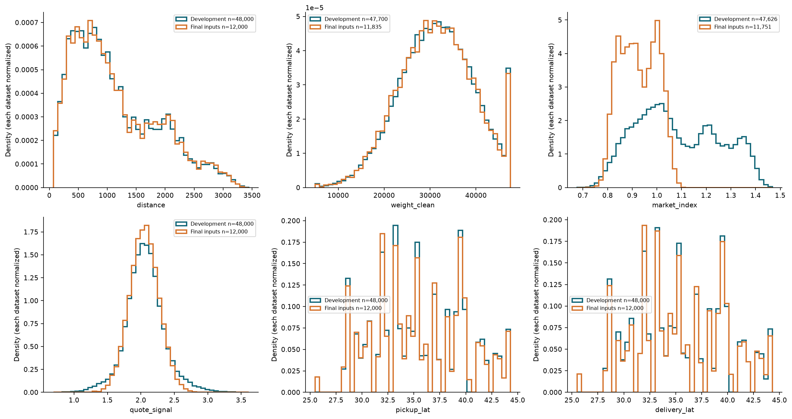

Both densities are normalized over each dataset and use shared full-range bins; missing counts are reported separately.

KS D and total variation are descriptive distribution distances, not model-quality metrics. Differences include seasonal mix, new locations, sample size, and sampling variability. Do not use final-input distributions to select features, tune hyperparameters, fit preprocessing, or claim prediction accuracy. The actual task extrapolates from January–October labels into November–December; use chronological development validation.

The fixed December chart scenario omits market and quote signals. Coordinates can use deterministic supplied city lookups, but genuinely unavailable future values must not be fabricated. Feature availability must be considered alongside later development-only validation.

## Eight findings for modeling and the Loom

1. Distance is the strongest observed marginal driver of total rate: Pearson 0.909, Spearman 0.976. A distance baseline is essential; these are correlations, not model metrics.
2. Rates are right-tailed: median $2,030.76, mean $2,373.98, maximum $25,533.00. Retain the 103 rates above $10,000 and investigate provenance; compare direct/log targets and examine MAE/RMSE later.
3. Equipment changes the observed rate-per-mile distribution: median Dry Van $2.05, Flatbed $2.22, Reefer $2.31. Lane and distance confounding prevents a causal premium claim.
4. Calendar and freight mix matter: monthly median $/mile moves from 2.029 in January to 2.248 in June. No November–December labels exist, so validation must respect chronology and cannot establish full-year seasonality.
5. Handle quality problems explicitly: development/final inputs have 300/165 missing weights, 292/145 negative weights, and 374/249 missing market indices. Preserve rows; compare raw weight against absolute weight plus flags using training-fold preprocessing only.
6. Unseen categories are a real inference requirement: 1,447 final rows contain new cities and 1,461 contain new routes. Keep numeric geography as a candidate and test unknown-category handling. Route-only categories are brittle.
7. Market index shifts from a pooled mean of 1.083 to 0.927, but monthly values contextualize the difference. Short-haul/long-haul and calendar mix also affect rate per mile; descriptive shifts must not become final-data tuning.
8. Quote signal has weak marginal associations (target Pearson -0.040, $/mile Spearman 0.091). Do not assume usefulness or leakage without provenance and chronological ablation. December omits both quote and market signals; use legitimately available features or explicit missing handling.

## Reproducibility and limitations

All supplied-file hashes were identical before and after this run. All immutable inputs matched the original checksum manifest. All 48,000 development and 12,000 final-input rows are retained. The template and fixed December inputs are unchanged. This EDA does not calculate MAE, RMSE, R2, or hidden Spotter metrics; no model has been selected or trained.

Scatter plots show complete finite pairs and logarithmic price axes preserve the full positive tail. Histograms use fixed bin counts over the full observed range. Market ranking cutoffs affect display only. All outcome associations are observational and may reflect multiple correlated influences. Learned feature encoding, imputation, model selection, and tuning belong exclusively inside later chronological development experiments.
